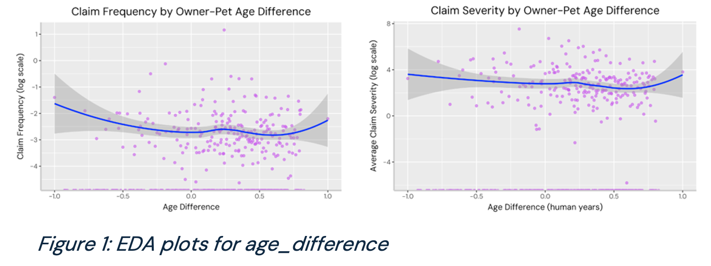
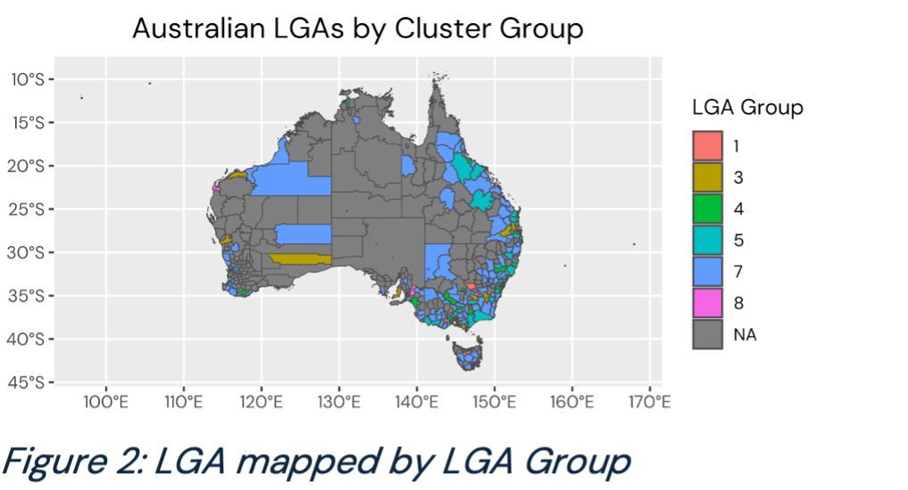
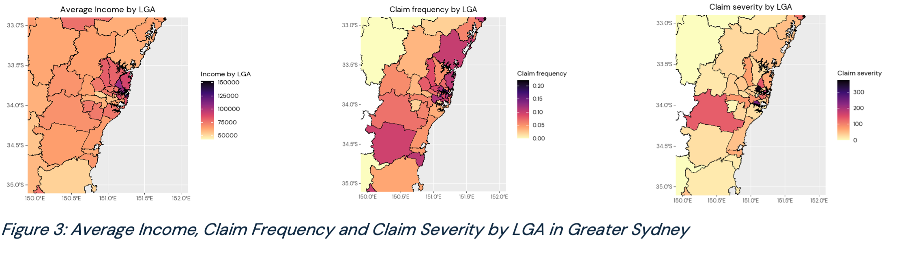
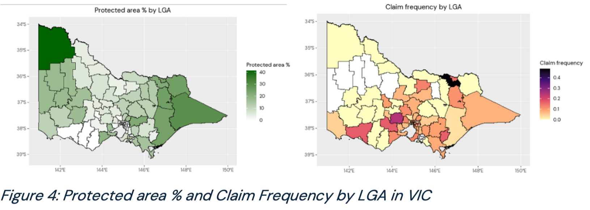
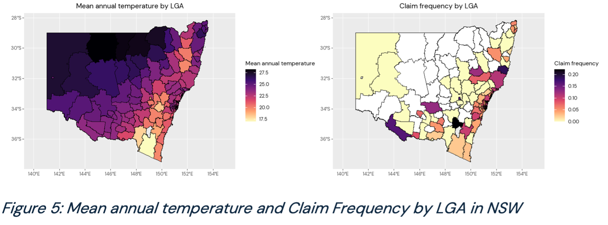
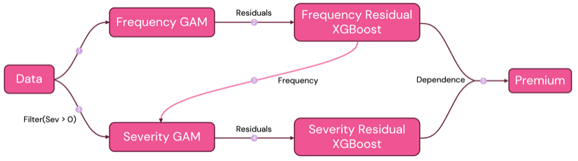

# Final Report

## 1. Executive Summary
Australia’s pet insurance industry is experiencing rapid growth at 14% per annum yet has significantly lower market penetration than other countries (Konstantinidis and Bu 2024). This reflects the market’s immaturity and the potential to develop a more accurate pricing model that truly captures pet health risks. There is also currently a lack of comprehensive data on pet risk factors, leading to potential discrepancies between anticipated and actual claims (McCoy et al. 2023). 

Therefore, we aim to engineer innovative factors from external datasets whilst constructing a robust model framework to create a pricing model that better reflects the diverse health risks associated with pets. This is essential not only to improve financial outcomes for us as insurers but also to provide affordable coverage for pet owners, thereby increasing market penetration and fostering overall industry growth.

This report outlines Fluffsure’s strategic approach to building this competitive pricing framework, starting with exploratory data analysis focused on data preparation and factor creation. Here, we engineered factors from external datasets belonging to three risk categories: canine, owner and environmental. We ultimately selected an Ensemble Method, combining the interpretability of a Generalised Additive Model with the model accuracy of a Gradient Boosting Machine. The final model’s RMSE was 1.079 for frequency and 752.76 for severity. We note that challenges in GBM hyperparameter tuning and capturing complex interactions in GAM, along with data limitations, may affect scalability, robustness, and accuracy.

## 2. Exploratory Data Analysis  

### 2.1. Data Preparation  

#### 2.1.1. Purchased Market Data  
Beginning from the raw purchased market data, several key processes were conducted to ensure that the data set was clean and insightful. To ensure data compatibility, each variable was addressed such that their data types aligned with its intended use. All categorical variables were treated as factors to capture their non-numeric nature and unique levels. All ‘date-time’ variables were converted to ‘date’ to remove redundant time information. Refer to Appendix 8.2 for a full list of variable data types. Further adjustments included removing unnecessary variables, rows with 0 earned units (earned dataset) and rows with claim_paid or total_claim_amount 0 (claims dataset).

The raw monthly data made for complexity in longitudinal exposure ID analysis as we were unable to visualise trends across a policyholder’s entire history. Thus, we aggregated the earned dataset by exposure ID. To ensure that each policyholder’s risk remained consistent with a monthly exposure period, we mutated ‘earned units’ to be the sum of earned units across a policyholder’s history. In this way, all calculated cumulative metrics were standardised. This was also done for the claims data in which duplicate claim IDs were grouped by summing all respective claim amounts. The two aggregated datasets were merged to create a comprehensive dataset that consolidated all relevant information about policyholder’s risk exposure and their claims behaviour. 

#### 2.1.2. External Datasets  
External datasets were largely organised by Local Government Areas (LGAs), meaning we had to map on LGAs to EARNED_DF. Without 1 to 1 mapping, we used public boundary shapefiles to calculate centroids for all the postcodes in Australia, and assigned each postcode to the LGA that its centroid fell in. However, some centroids would fall into bodies of water and for these we assigned them to the LGA at a minimum distance from the centroid. This mapping of LGA_CODE24 allowed us to map on various external datasets from the ABS. Notably, we also had one external factor (protected_area) which was organised by SA3. A rather straightforward mapping for postcode to SA3 was available in ABS data so this was used to map on this factor. 

#### 2.1.3. Data Cleaning  
Missing values within the data were handled with different methods depending on the type of variable involved. The missing values in variable pet_is_switcher, were treated as FALSE, assuming that the absence of data was due to new customers that never purchased pet insurance previously. Similarly, missing values from pet_de_sexed_age and nb_breed_trait were treated as “Not desexed” and “cross” respectively based on their context from other variables such as pet_de_sexed and nb_breed_type. 

The missing values for numerical variables and select categorical variables (Appendix 8.1) were imputed using a regression-based imputation with an XGBoost model to predict the missing values based on other related factors. As a result, this hybrid imputation model helped us attain more accurate estimates.

K-means clustering was utilised for dimensionality reduction to analyse patterns within multidimensional data, such as breed names and LGA codes, based on claim frequency and claim severity. The number of clusters were chosen using the elbow method, allowing us to examine the variables by claim risk profile.

### 2.2. Key Factors  
This section outlines key factors in our final model categorised into three main risk levels affecting pet health: canine risk and social determinants, specifically owner and environmental risks (McCoy et al. 2023). Refer to Appendix 8.2 for all our selected factors and descriptions and Appendix 8.3 for further EDA plots.

#### 2.2.1. Canine Risk  
To capture the inherent risks in dog breeds, we mapped breed characteristics to unique breeds, including traits like average weight from the American Kennel Club (AKC) data and genetic disorders sourced from the Humane Society Veterinary Medical Association. The genetic disorder factor only considered the 6 most common genetic disorders (Appendix 8.2) and additionally, allergies/atopic dermatitis (Cohan, 2016). 

An example of a canine risk engineered feature is age_difference, which measures the difference between owner age and pet age (converted to human years, see Appendix 8.2). Older pets face higher health risks, while younger pets with older owners may face risks risk due to decreased owner mobility resulting in decreased pet care quality (Bethesda Senior Living Community 2023). Figure 1 supports this, showing slight upticks in claim frequency and severity at either extremes of age differences.

The most significant canine risk predictor in our final models was avg_weight_kg. This is supported by Kraus et al. (2013), who found that larger dog breeds had accelerated aging and faced earlier health risks, such as neoplasia. Other significant factors included number_of_breeds and breed_trait which captured breed genetic diversity. Inbreeding, commonly seen in purebreds, increases disease risk (i.e., brachycephalic syndrome), compared to mixed breeds (Bannasch et al. 2021). Breed groups created by k-means clustering also proved significant as it informed claims risk profile patterns.

#### 2.2.2. Owner Risk  
Our factor selection analysis showed that LGA groups were highly significant across both claim frequency and severity. This highlights the correlation between geographic location and key demographic, socioeconomic and lifestyle factors that play a role in determining pet ownership behavior. It was shown that higher severity claims largely came from more urban LGA’s, such as LGA Group 8 (Figure 2) whilst rural LGA’s, such as LGA Group 7 (Figure 2) typically had lower severity. Urban LGA’s also had lower claim frequency highlighting the impact of factors such as access to advanced veterinary care and differences in pet exposure to outdoor hazards. (Neal and Greenberg, 2022) 

The ideal family and household variables were created by taking the interaction between factors obtained from ‘ABS Socioeconomic – Family and Community’ data. Family_Ideal assumes that the ‘ideal’ family consists of middle-aged owners who are married, have a purebred dog and are a small family whilst the ideal household is a family that consists of more than 3 people, owns the property and has at least 2 cars. These factors capture key aspects of family stability, pet care responsibility, and financial capacity, which are aligned with trends in pet ownership preferences and pet-related spending habits. Full graphs of this factor can be found in Appendix 8.3.2. 

Three income measurements were considered: income by LGA, by age and a combined weighted income. Whilst the LGA data was granular enough to map onto our dataset directly, further calculations were required for income by age. From the distribution of age and income obtained by ABS data, a log-normal extrapolation was used to predict income given age. However, due to the lack of granular age data and the strong assumptions used in the calculation, income by LGA was the most significant variable. Income had a positive correlation with frequency and severity, reflecting that pet owners with higher income have less price sensitivity and will not avoid treatment based on cost. (Appendix 8.3.2), (Park, Gruen and Royal, 2021) This result is evident in Figures 3, 4 and 5 in which higher income LGA’s, which are largely urban LGA’s, are matched with higher frequency and severity claims in comparison to lower income areas. 

#### 2.2.3. Environmental Risk  
Our final factor type is environmental. These were mapped by postcode, SA3 or raster values where available for maximal accuracy. Two of our environmental factors are detailed below. Australia-wide plots of these factors can be found in Appendix 8.3.3, while choice areas have been highlighted in the main report.

From the ABS we extracted 'Total protected areas %' representing the total proportion of an SA consisting of protected areas (spaces ‘set aside for conservation and managed by the NSW National Parks and Wildlife Service’). We joined SA3 to postcode using an ABS mapping file, and for postcodes which fell across more than one SA3, we initially assigned the SA3 with the maximum allocation. After further consideration, a more accurate weighted average of protected_area was taken from all the SA3s making up a postcode. As an introduced species, domestic dogs are known to harm native wildlife. From our EDA, we have deduced that this relationship goes both ways - a higher proportion of protected areas within a postcode will increase the likelihood and severity of claims. In fact, a 1998 study by Mirtschin et al. estimated 6,200 dog-snake bite cases reported annually in Australia. This frequency has likely increased as the Australian population inflates and our living spaces overlap increasingly with the native habitats of wildlife. With antivenom alone costing a minimum of $1,000 in Australia and other medical fees easily bringing a snakebite total per patient to $4,000-6,000, (Kelly, 2020), this risk also poses significant loss potential. The proportion of protected areas within a postcode can thus act as a proxy for wildlife driven claims, increasing both the probability and severity of a claim. In Figure 4, a positive correlation can be observed with claim frequency in the more rural Victorian areas. This matches our hypotheses on the underlying risks - [snake]bites are more prominent in rural (78% incidence) than urban areas (22% incidence) (VetTriage, 2024). 

Temperature was another significant environmental factor, proxying for several different underlying risks. Average annual temperature was available from the Bureau of Meteorology at raster level to map onto our postcode data. While this is a non-traditional factor for pet insurance, the exacerbation of extreme heatwaves in Australia due to climate change places increasing weight on climactic variables such as these. Most dogs prefer temperatures under 32oC, with older, overweight, or thick coated dogs particularly vulnerable to heat stress. (Hall et al., 2020).  Notably, while proxying for health risks, temperature by location can strengthen prediction for other risks such as snakebites and zoonotic diseases like ticks (Berry, 2021), both significantly more active in warmer temperatures. Figure 5 displays the average temperature and claim frequency in New South Wales. Higher inland and coastal temperatures visibly correlate with higher claim frequency along the border.

## 3. Model Development and Validation  
Our objective in the model development and validation processes was to design a mathematically rigorous, parsimonious, and interpretable model that would accurately price premiums according to the data and the engineered features. We decided to implement a frequency-severity modelling approach in line with the industry standard, including an innovation to address the independence assumption of frequency and severity (Garrido et al. 2016). The provided data with 9235 observations was split into 80-20 training-testing split. To reduce the variability in the results, we winsorised the claim counts to their 99th percentile, thus reducing the maximum claim count from 22 to 7. Similar winsorisation was applied to the claim severity to the 99.8th percentile reducing the maximum from 13195 to 2761 while keeping the median the same. Our target variables were claim count, which had to be corrected for exposure units, and claim paid, representing the insurer's liability. 

The continuous predictor variables were then standardised and the factor variables were one-hot encoded into dummy variables. We considered three main model families: generalised linear models (GLMs), generalised additive models (GAMs) and gradient boosting machines (GBMs). Our final approach used an Ensemble Method, combining the interpretability of the GAM with the model accuracy of the GBM.

### 3.1. Generalised Linear Models
We modelled two GLMs, one for claim frequency and one for claim severity. For claim frequency, we considered the Poisson, Negative Binomial, and Quasi-Poisson distributions and settled on the Negative Binomial with the logarithmic link based on the criteria of having the lowest root mean squared error (RMSE). Similarly, we considered the Gamma and Log-Normal and decided on the Log-Normal family with a logarithmic link function. The frequency model had some issues with overdispersion, which was corrected by choosing the Negative Binomial model. The severity model also faced issues mostly with signal-to-noise ratio in the data, due to having less data. 
|                | Frequency Models        |                 | Severity Models        |                 |
|--------------|----------------------|-----------------|----------------------|-----------------|
| GLM Family   | Poisson              | Negative Binomial | Gamma                | Log-Normal      |
| AIC         | 50095                | 46657           | 16452                | 3786            |
| RMSE        | 1.1252                | 1.1272          | 763.35               | 820.25          |

The model diagnostics demonstrate issues with the model fit towards the right tail of the distribution, which is common for insurance datasets, where the extremities contain more noise. We chose the Negative Binomial family due to a lower AIC value, and a better ability to handle overdispersion. For the severity model, the choice was less clear. The Log-Normal had a better AIC and better diagnostics, at the cost of model accuracy, and the Gamma had a better RMSE, but we had concerns about its generalisability to unseen and longer term risks and could be performing better due to the winsorisation step. We further tuned the model by performing stepwise feature selection and lasso regression, which improved each model’s robustness.

### 3.2. Generalised Additive Models
In an effort to capture some of the nonlinearities present in the data, we used a generalised additive model (GAM) to improve the model’s generalisability with the hope that the relaxation of the linearity assumptions would help the model capture more information. Incorporating these models showed both better model performance on test data, as well as better model fit as seen in the model diagnostics, which showed a significant improvement in the frequency model’s right tail. We observe that where with GLMs there was debate as to whether the Log-Normal or Gamma was better, it seems that the obvious choice is the Gamma, as the issues with model fit are now resolved with the introduction of smooth terms. Utilising the gam.check() function in mgcv package allows us to analyse our choice of basis function dimensions for the smoothed variables. When including these improvements, our final frequency and severity models now showed RMSE values of 1.089 and 754.7 respectively.

| GAM Model   | Frequency Models         |                 | Severity Models         |                 |                 |
|------------|------------------------|-----------------|------------------------|-----------------|-----------------|
|            | NegBin (Stepwise)       | NegBin (XGB)    | LogN (Stepwise)        | LogN (XGB)      | Gamma (XGB)     |
| RMSE       | 1.138844                | 1.089177        | 806.9263               | 836.9739        | 754.7094        |

### 3.3. Gradient Boosting Machines
Since dealing with a complex dataset, we experimented with gradient boosting machines to attempt to capture complex interactions among predictors. The method combines numerous decision trees through a boosting approach, optimising performance by addressing the errors of preceding trees. Key hyperparameters such as the number of trees, the depth of splits within each tree and the shrinkage parameters were also tuned using the xgb.cv() function and MLR package to better fit the model. This process resulted in relatively low RMSE values of 1.02837 and 160.8367 for the frequency and severity models respectively. However, since we aimed to balance predictive accuracy with interpretability, relying solely on GBM as our final model wasn’t ideal. Instead, we proposed a hybrid approach, retaining GAM as the backbone while overlaying a GBM layer to capture potential patterns in the residuals. This strategy allowed us to mitigate the interpretability challenges of GBM while addressing the technical limitations of GAM.

### 3.4. Feature Selection
#### 3.4.1. GBM Feature Selection
Feature selection plays an important role in our modelling process by removing irrelevant data to reduce model training time and risk of overfitting. We decided to leverage XGBoost model due to its ability in capturing complex, non-linear interactions among variables. Its output was transformed into a variable importance plot to easily assess the influence of each feature on the model's prediction and select the ones that impact the outcome. This is valuable as our dataset contains a lot of variables and identifying the most relevant predictors can significantly reduce noise, improve model accuracy and reduce computation time. From our variable importance plots (see Appendix 8.4), we were able to reduce our variables, and our model performed better which will be discussed in depth under section 5.

#### 3.4.2. Factor Interaction
To further enhance our model factors, we analysed interactions between our continuous and categorical factors. This was key to identifying dependencies between variables that individual analysis may overlook. To visualise the interactions, we plotted a continuous variable against claim frequency or severity, overlaying smoothed trend lines for each level of the categorical factor using Loess. An overall baseline was included to illustrate the categorical factor without distinguishing levels. When a trend line diverged significantly from the overall baseline with low variance, this indicated a meaningful interaction. We observed that categorical factors frequently interacting with continuous factors included excess, pet_de_sexed, breed_group and pet_is_switcher. This informed the creation of interaction terms in our model such as pet_age and $100 excesses. This is a reasonable interaction as owner behaviour in selecting excesses may change if their pet is older or very young due to increased health risks. (see Appendix 8.5 for an example of the interaction plots)

### 3.5. Model Ensembling
The difficulties we faced when deciding which model to use were the trade-offs between model complexity and interpretability. While the GLM was the worst-performing model, it was also the most interpretable, with coefficients that would describe the impact of changing one factor and its subsequent effect on premiums. The GBMs performed comparably better but lost their model interpretability, where variable importance was identifiable but not its impact on the premiums. The GAMs provided a middle ground of including the model interpretability while improving performance.

However, our final model is an attempt to retain the general structure of the GLM, while being able to utilise GBMs and their performance improvements.  We used the residuals of the GAM for severity and frequency as the response of the GBM, and trained XGBoost to predict the residuals. The idea was to use the GAM to capture the overarching effects of the data and being able to retain interpretability, while using the GBM to reduce the unexplained variance in the data. This resulted in further RMSE improvements for residual frequency (0.8445) and residual severity (421.80).

## 4. Results and Discussion  

### 4.1. Model Performance Comparison  
The residual analysis and QQ Plots for the GLMs, GAMs and the final model can be seen in Appendix 8.7. We observe that the GLMs suffer from model inadequacy where the QQ Plots show deviations from the theoretical quantiles, particularly at the extremes. This is largely corrected by the GAMs with a better ability to capture non-linearities in the data. The final ensemble methods demonstrate the ability to reduce the residual variance and hence creating a more robust model. The final RMSE of our model was 1.079 for frequency and 752.76 for severity. The XGBoost Ensembling was a marginal improvement, which gave us confidence that the model was not overfitting and that the residuals were mostly noise and did not contain systematic information about claims. 

### 4.2 Predictive Factors  
Examining the coefficients of the frequency GAM, we observe the following as the main predictive factors for modelling claim frequency: 
- Owners from NSW are less likely to make claims
- Owners in LGA Group 7 and 4 are least likely and most likely respectively to make claims
- Dogs in Breed Group 5 are less likely to make claims
- Hounds, pointers and terriers are more likely to make claims
- Dogs from Breed Concat Group 9 are significantly more likely to make claims
- Designer breeds and purebreds are less likely to make claims
- Male dogs are more likely to make claims
- Dogs with higher energy levels are less likely to make claims
- Age differences at the extremes indicate a higher claim rate
- Higher income owners make more claims
- LGAs with higher SEIFA score are more likely to make claims
- April and December have highest claim rates, while August has the lowest claim rate
- Pets who live in apartments make claims more frequently 

We observe the following predictors for claim severity:
- Owners with two breeds make smaller claims
- Breed Concat groups 3 and 9 make significantly smaller claims while groups 6, 7, 8 and 10 make larger claims
- LGA groups 5 and 7 make smaller claims
- Owners with more expensive dwellings make larger claims
- Owners with high incomes make larger claims
- LGAs with lower amounts of protected area tend to make larger claims
- Pets in houses as opposed to apartments have more severe claims, but less frequently 

The overarching themes are that geographic areas that are more socioeconomically well off are more likely to spend more on their pets, which correlates to indicators such as income, dwelling prices and number of cars. Broadly speaking, dogs which are larger and have a longer average lifespan tend to make larger claims as well, likely due to health issues. Males also make larger claims but less frequently than females. A full breakdown of the model results can be found in the provided R Codes. 

## 5. Limitations & Implementations
While our model successfully fitted the training data and achieved relatively low error rates, certain limitations remained. The GBM aspect of our model relied on cross-validation and extensive grid search to identify values for our hyperparameters that would optimise the model and return accurate variable importance analysis without overfitting. However, given the large number of variables within our final dataset, this was computationally intensive. If extra variables were added, refitting the model could potentially be unfeasible due to the associated computational costs. The GAM aspect of our model faced challenges in capturing complex, high-order interactions between predictors. Although we manually added interaction terms to account for these complexities this approach is not a robust solution.
There were also limitations in the provided datasets that impacted our model. Primarily, our dataset focused solely on dogs resulting in creating and selecting final factors based on the significance they had on dog claims. There were also missing values, which required us to impute or manually map values where appropriate. Although it was effective, the final model’s accuracy could be impacted by these limitations. To address these limitations in future implementations, we recommend expanding the dataset to include other animals and improving data quality to minimise missing values. Enhancing the dataset will increase the model’s applicability for broader pet insurance analysis and improve its predictive accuracy. These adjustments would ultimately contribute to a more robust and versatile model that remains competitive in the pet insurance industry.

## 6. Conclusion  
With our model built on an extensive and unique set of predictors, fluffsure has a guaranteed high standard of strength and accuracy such that our developed pricing framework is competitive within the industry. By integrating external datasets, we created meaningful risk factors across three key categories—canine, owner, and environmental. We developed our model using an ensemble approach which combined the interpretability of a GAM with the predictive power of a GBM, capturing the complex relationships within our predictor variables. As such, fluffsure is well-positioned to offer a pricing framework that is not only competitive within the pet insurance industry but also finely tuned to the specific needs and behaviours of pet owners.
